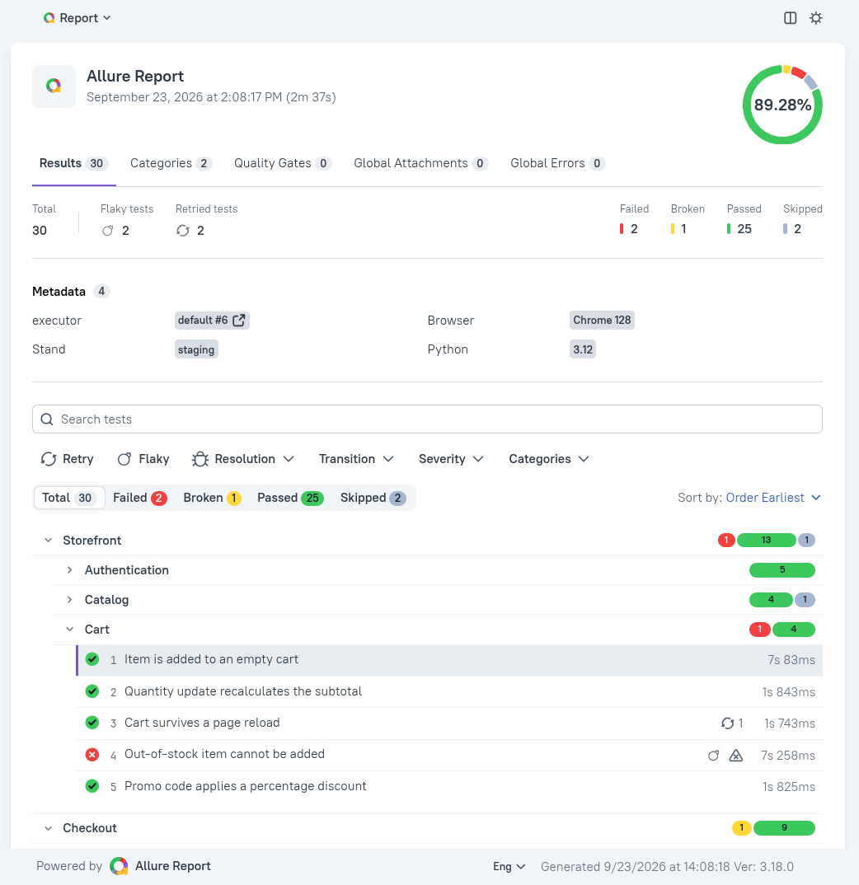
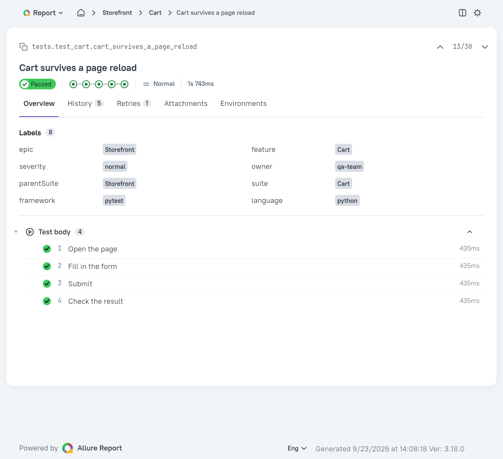
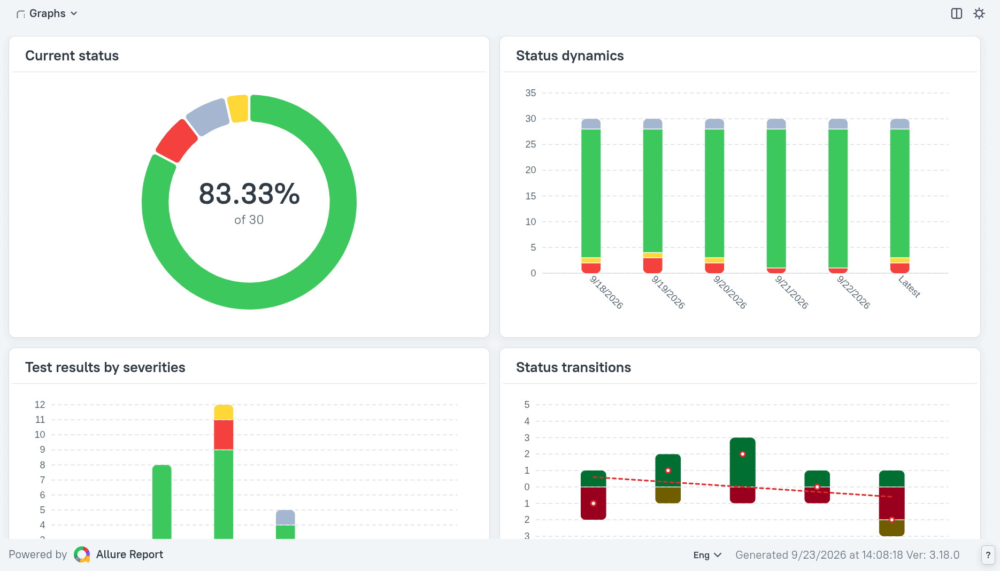
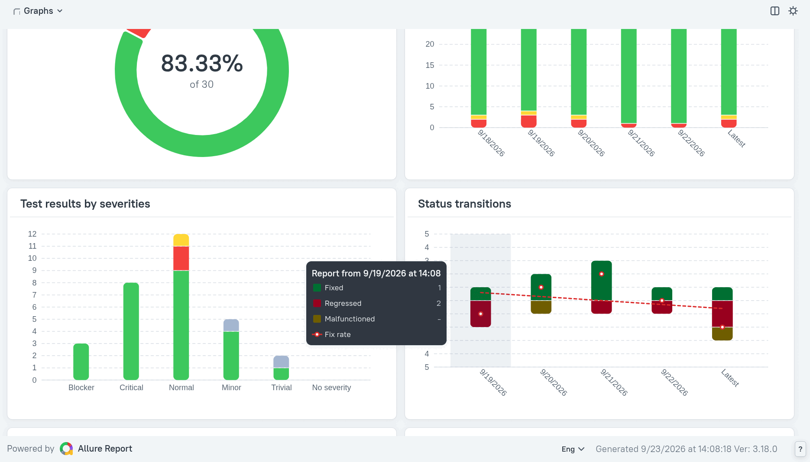

# allure3-docker-service-go

A web service that stores and serves **Allure 3** test reports with the history of previous runs.

This is a **fork** of [`fescobar/allure-docker-service`](https://github.com/fescobar/allure-docker-service), rewritten from **Python/Flask + Allure 2 (Java)** to **Go + Allure 3 (Node.js)**. See [Differences from upstream](#differences-from-upstream).

Each release ships one pinned version of the Allure 3 CLI, and the service's own version is independent of it. The release notes name the Allure version that release was built with; a running instance reports both at [`GET /version`](#info-endpoints), and the pin itself is the `ALLURE_VERSION` build arg in [`docker/Dockerfile`](docker/Dockerfile).

> ⚠️ **No authentication.** Everything documented below works, but the service authenticates nobody: whoever can reach the port can upload results and delete projects. Deploy it **only inside a trusted internal network**. Built-in auth is planned — see [Not implemented yet](#not-implemented-yet).

Table of contents
=================
* [What it does](#what-it-does)
* [Quick start](#quick-start)
   * [Docker Compose](#docker-compose)
   * [Docker run](#docker-run)
   * [Running from source](#running-from-source)
* [Generating Allure results](#generating-allure-results)
* [Configuration](#configuration)
   * [The watcher](#the-watcher)
   * [Resource limits](#resource-limits)
* [Storage layout](#storage-layout)
* [HTTP API](#http-api)
   * [Info endpoints](#info-endpoints)
   * [Project endpoints](#project-endpoints)
   * [Results endpoints](#results-endpoints)
   * [Report generation](#report-generation)
   * [Report endpoints](#report-endpoints)
* [Typical CI workflow](#typical-ci-workflow)
   * [Several pipelines, one project](#several-pipelines-one-project)
   * [Answers the report step can get](#answers-the-report-step-can-get)
* [Opening the report](#opening-the-report)
* [Deploying](#deploying)
   * [File permissions](#file-permissions)
   * [Day-to-day operations](#day-to-day-operations)
   * [Updating](#updating)
   * [Kubernetes](#kubernetes)
* [Known issues](#known-issues)
* [Not implemented yet](#not-implemented-yet)
* [Differences from upstream](#differences-from-upstream)
* [Development](#development)
* [Acknowledgements](#acknowledgements)
* [License](#license)

## What it does

Allure turns the results of a test run into a report, but on its own it leaves two problems to you:

- **Where does the report live?** The CLI writes a static site to disk. After every run someone has to build it, host it and share a new link.
- **What happened in earlier runs?** Allure 3 draws trends and marks tests `new`, `flaky` or `regressed` only by comparing against the history of previous runs. A CI job usually starts in a clean workspace, so every report shows a single run with nothing to compare it to.

This service solves both. CI uploads a run's `allure-results` over HTTP, and the service builds an **Allure 3 (Awesome)** report and:

- **publishes it at one stable URL per project** — `/projects/{id}/latest-report` always opens the newest run, and a failed build never replaces the last good report;
- **keeps the project's history** — the trend charts span past runs, each test shows its own history, and each of those runs stays archived: a click on its bar in the chart opens it. Both the history and the archives are trimmed to the last `KEEP_HISTORY_LATEST` runs (60 by default), so a link disappears together with its bar; `KEEP_HISTORY=false` turns history off entirely. Bars of runs built before the service could link them (versions below 0.3.0) stay inert.

<picture>
  <source media="(prefers-color-scheme: dark)" srcset=".github/images/report_main_dark.png">
  
</picture>

<picture>
  <source media="(prefers-color-scheme: dark)" srcset=".github/images/report_details_dark.png">
  
</picture>

<picture>
  <source media="(prefers-color-scheme: dark)" srcset=".github/images/graphs_current_dark.png">
  
</picture>

<picture>
  <source media="(prefers-color-scheme: dark)" srcset=".github/images/graphs_status_dark.png">
  
</picture>

You produce the `allure-results` yourself, with the Allure adapter for your stack (pytest, TestNG, JUnit, Cucumber, Playwright, etc.). Projects are isolated from each other; one called `default` is created on start.

## Quick start

Images are published to GHCR for `linux/amd64` and `linux/arm64`:
**`ghcr.io/y-krenta/allure3-docker-service-go`** ([all versions](https://github.com/y-krenta/allure3-docker-service-go/pkgs/container/allure3-docker-service-go)). Everything is served on a single port, **5050**.

Pin an exact version in production and move it deliberately; `latest` exists for trying the service out.

### Docker Compose

The repository ships a ready [`docker-compose.yml`](docker-compose.yml), pinned to an exact release — copy that one for a real deployment. The block below is the same thing on `latest`, for a first look:

```sh
mkdir -p .data/projects && sudo chown -R 1000:1000 .data/projects   # Linux only, see File permissions
docker compose up -d
docker compose logs -f allure-service
```

```yaml
services:
  allure-service:
    image: ghcr.io/y-krenta/allure3-docker-service-go:latest
    restart: unless-stopped
    environment:
      PUBLIC_BASE_URL: http://allure.internal:5050   # required, the address CI and browsers reach this service at
      KEEP_HISTORY: 1
      KEEP_HISTORY_LATEST: 60
      CHECK_RESULTS_EVERY_SECONDS: 0     # 0 — watcher off, reports are built on request
    ports:
      - "${ALLURE_SERVICE_PORT:-5050}:5050"
    volumes:
      - ./.data/projects:/app/projects
```

Mount the **projects root as a whole**. Publishing a report renames a directory out of `.tmp` into `reports/latest`, and `rename` does not work across filesystems — mounting a subdirectory of it breaks generation.

### Docker run

```sh
docker run -d -p 5050:5050 \
           -e PUBLIC_BASE_URL=http://allure.internal:5050 \
           -e KEEP_HISTORY=1 -e KEEP_HISTORY_LATEST=60 \
           -v ${PWD}/.data/projects:/app/projects \
           ghcr.io/y-krenta/allure3-docker-service-go:latest
```

On Windows `${PWD}` only works in [Git Bash](https://git-scm.com/downloads) (`-v "/$(pwd)/.data/projects:/app/projects"`); in PowerShell/CMD use an absolute path.

### Running from source

The [Allure 3](https://allurereport.org/docs/) CLI on `PATH` is required:

```sh
PUBLIC_BASE_URL=http://localhost:5050 \
STATIC_CONTENT_PROJECTS="$PWD/.local/projects" go run ./cmd/allure-service
```

`STATIC_CONTENT_PROJECTS` is mandatory on a dev machine: the default `/app/projects` is a container path and `MkdirAll` on it fails with `permission denied`. The directory (and the `default` project inside it) is created on start.

`PUBLIC_BASE_URL` is mandatory everywhere and has no default: the service cannot guess the address it is reached at, and every report is stamped with urls built from it. It must be absolute — scheme and host — or the service exits at startup.

The Allure CLI is resolved at startup with `exec.LookPath`; if it is missing, or `allure --version` fails, the service exits immediately rather than discovering it on the first build:

```
2026/08/13 00:34:39 history limit 60, max concurrent builds 4, build heap 2048 MB
2026/08/13 00:34:39 allure /opt/homebrew/bin/allure (3.19.0)
2026/08/13 00:34:39 Starting server on port 5050
```

`Ctrl+C` / `SIGTERM` shuts down gracefully: the watcher stops first, so no new build is started on the way out, and requests already in flight get a 25-second drain. Long uploads and exports can outlast that and are cut off — the Compose file allows a 30-second `stop_grace_period` to leave room for the drain, so raise both together if you need more. A report build in progress is not waited for: builds publish by renaming a finished tree into place, so one cut short leaves the last good report standing.

## Generating Allure results

This service generates reports **from results** — you must produce `allure-results` yourself with an Allure adapter for your test stack.

- Allure docs & adapters: https://allurereport.org/docs/
- Allure integrations: https://github.com/allure-framework

The raw `allure-results` directory (the `*-result.json` / `*-container.json` files plus attachments) is what you upload to the service.

### Adapter versions and history

Any adapter that writes Allure 2 results works, and so does the Allure 1 XML format. History is a different matter. Allure 3 matches a test to its past runs by the `testCaseId` the adapter writes. Some adapter releases changed how that id is computed. If you upgrade across one of them, history breaks: every test shows up as `new`, its history panel starts empty, and a `history/seed` baseline built on the old version no longer matches. History from an Allure 2 installation is not imported either way.

Pick a version at or above the last boundary before your first build here. After that, pin the exact version:

| Adapter | Minimum | Identity changed in |
|---|---|---|
| `allure-pytest` + `allure-python-commons` | 2.8.0 | 2.8.0 (earlier versions write no `testCaseId`); unchanged 2.8.0 → 2.16.1 |
| `allure-playwright` | 3.9.0 | 2.7.0 and 3.9.0 |
| `allure-jest` | 3.9.0 | 3.0.0 and 3.9.0 |
| `allure-vitest` | 3.9.0 | 2.12.1, 3.0.0 and 3.9.0 |

Other adapters have not been checked. Their test identity may have changed at different versions.

From 3.9, allure-js adapters include the `name` in `package.json` in a test's identity (verified with Jest). Renaming the package therefore breaks history too.

Avoid `allure-vitest` 2.14.0 and 3.0.0–3.0.6. They write fractional-millisecond timestamps, and Allure 3.18's durations chart crashes on them. The CLI still exits 0 but leaves no `index.html`.

Allure-js 3.9+ also writes the old id as a `_fallbackTestCaseId` label. Allure 3.18 reads that label only in its chart code. It does not restore a test's history or its `new` / `regressed` status. If you have already crossed a boundary, run `POST /projects/{id}/history/clean` so that old and new ids don't mix in one history.

## Configuration

All configuration is environment variables; invalid values fall back to the default with a warning in the log.

| Variable | Default | Effect |
|---|---|---|
| `PUBLIC_BASE_URL` | — | **Required.** Absolute public address of this service, e.g. `http://allure.internal:5050`. Report urls are built from it; a missing or relative value exits at startup |
| `PORT` | `5050` | HTTP listen port |
| `STATIC_CONTENT_PROJECTS` | `/app/projects` | Projects root on disk. Must be set when running outside the container |
| `ALLURE_BIN` | `allure` | Allure CLI name or path; a bare name is looked up in `PATH` |
| `KEEP_HISTORY` | `true` | Accumulate run history between builds. `false` means **erase**: the history limit collapses to `0` and `history.jsonl` is truncated on every build |
| `KEEP_HISTORY_LATEST` | `60` | How many past runs to keep — the same number of points in the trend chart, and the same number of archived reports |
| `CHECK_RESULTS_EVERY_SECONDS` | `0` | Watcher interval. `0` disables it; reports are then built only via the API |
| `MAX_CONCURRENT_BUILDS` | `4` | Builds running at once across all projects. More are accepted and wait for a free slot, reading `running` meanwhile. Values below `1` mean `1`. See [Resource limits](#resource-limits) |
| `BUILD_HEAP_MB` | `2048` | V8 old-space cap of one build, in MiB (`--max-old-space-size`) — enough for ~10 000 tests with 60 runs of history. `0` leaves it to Node. See [Resource limits](#resource-limits) |

The effective limits are printed at startup as `history limit N, max concurrent builds K, build heap H MB`.

`SECURITY_ENABLED=1` and `TLS=1` **refuse to start** (`SECURITY_ENABLED is not supported`, `TLS is not supported`) — better a loud failure than a service that silently ignores the flag and either serves everything unauthenticated or carries in cleartext what the operator believes is encrypted. `OPTIMIZE_STORAGE` and `DEV_MODE` are parsed but do nothing yet; setting either logs a warning at startup.

### The watcher

With `CHECK_RESULTS_EVERY_SECONDS=N` the service polls every project's `results/` directory every `N` seconds and starts a build whenever its fingerprint (file count, total size, newest mtime) changes. The first sweep only records fingerprints, so a restart does not rebuild everything.

- **On** (e.g. `3`) suits a **local** machine, where you drop results into the mount and want a report without calling anything.
- **Off** (`0`) suits a **server fed by CI**: nothing regenerates until the pipeline asks for it, and a report then corresponds to exactly one execution. This is the default and what [`docker-compose.yml`](docker-compose.yml) ships with.

A watcher build refused for lack of a slot is retried on the next sweep.

### Resource limits

Every build is a separate `allure generate` process — Node — and its memory grows with the number of tests and, above all, with history. Uploads stream to disk and the Go service itself idles at ~50 MB, so the footprint is *builds running at once × memory of one build*. The service limits the two factors it controls — build concurrency and V8 old space — while the container provides the hard resource ceiling:

- `MAX_CONCURRENT_BUILDS` (4) caps the number of builds. It is an operational trade-off, not a measured optimum: a 10 000-test build takes ~20 s, so four slots pass about 12 such builds a minute, and a build requested while all four are busy is accepted and waits for a slot. The queue holds at most one build per project, since a second request for a project that is already building gets `409`; the 10-minute build timeout starts only once the slot is taken. Raising it to 6 is fine as throughput tuning, but it raises the memory and CPU demand along with it.
- `BUILD_HEAP_MB` (2048) caps each build's V8 old space, in MiB — the service hands it to the CLI as `--max-old-space-size`, after any `NODE_OPTIONS` of your own, so it always wins. 10 000 tests pass with 1536 MiB, but the heap was searched in 512 MiB steps: all that is known is that 1024 is too little and 1536 is enough, so 2048 is the margin. Old space is not the whole process — the young generation, buffers and native memory come on top, ~300 MiB per build.

Out of the box, four concurrent builds are estimated at 4 × (2048 + ~300 MiB) ≈ 9.2 GiB of build memory. Measured with those defaults and no CPU limit, four parallel 10 000-test builds peaked at 6.4 GiB in the build processes and at 7.8 GiB in the container's cgroup, page cache included; nothing was OOM-killed, and the run took 56 s at 7.5 cores on average. CPU is not capped by the service: a 10 000-test build averages 2.3 cores, and the 7.5 is load observed on a 12-core host, not a limit or a worst case.

A build that outgrows its heap fails with `JavaScript heap out of memory`; `reports/latest` keeps the previous report. `BUILD_HEAP_MB=0` leaves the heap to Node, which then takes a quarter of the container's (or the host's) memory per build.

Measured on synthetic results (3–5 steps per test, a text attachment on each, a screenshot on every tenth, 15% failed) with 60 runs of history, one build:

| Tests | Memory | Time | CPU | Smallest heap that passes |
|---|---|---|---|---|
| 1 000 | 0.4 GB | 2 s | 1.2 cores | — |
| 3 000 | 0.7 GB | 6 s | 1.7 cores | 512 MiB |
| 6 000 | 1.2 GB | 11 s | 2 cores | 1024 MiB |
| 10 000 | 1.7 GB | 20 s | 2.3 cores | 1536 MiB |
| 20 000 | 3.3 GB | 57 s | 3.2 cores | 3072 MiB |
| 50 000 | 7.4 GB | 7 min | 3.6 cores | 7168 MiB |

Memory scales linearly with parallel builds, and it depends on the results, not on the hardware: a faster server builds sooner, not in less memory. Fewer history runs (`KEEP_HISTORY_LATEST`) cut it as well.

**Container limits are the hard ceiling.** The service's caps cannot stop a leak or growth outside the V8 heap — Go memory, Node's native allocations, buffers — and the host's other tenants deserve a guarantee that does not depend on this service's code. The compose file ships:

- `mem_limit: 16g` — the hard memory ceiling for the whole container. The default configuration runs with a 16 GiB memory limit and swap disabled: the last boundary for memory growth the service does not control. 16 GiB is chosen for hosts with 32 GiB, leaving the rest to the OS, Docker and other workloads; it is not derived from the estimate above, which it clears by ~7 GiB. Size it for your host: Docker does not check `mem_limit` against the host's RAM, so on a host with 16 GiB or less this limit restrains nothing. With your own settings, keep it no lower than `MAX_CONCURRENT_BUILDS × (BUILD_HEAP_MB + 300 MiB) + 0.5 GiB` — 9.7 GiB for the defaults.
- `memswap_limit: 16g` — the limit on memory **plus** swap, not swap on top of memory: equal to `mem_limit`, it means 16 GiB of RAM and no swap, so an overrun ends in an OOM kill instead of swap thrashing that drags a build into its timeout. Only a `memswap_limit` above `mem_limit` allows swap — and leaving it unset allows as much swap as `mem_limit`, which is why it is set explicitly.
- `pids_limit: 512` — a cap on processes and threads together, against a leak of child processes or a fork bomb. It depends relatively little on the host: four concurrent 10 000-test builds peaked at 63 tasks, a margin of 8×.
- `# cpus: 4` — commented out, since the CPU budget is specific to each deployment. A lower `cpus` only makes builds slower: four 10 000-test builds under `cpus: 4`, `mem_limit: 8g` and `BUILD_HEAP_MB=1536` took 83 s instead of 56 s; four 6 000-test builds took 38 s. Keep an eye on the build timeout, though: generation is killed after 10 minutes, and 50 000 tests already take 7 with 3.6 cores. Docker rejects a value above the CPU resources available to the Docker Engine; on the 12-CPU host used for validation, the accepted range was 0.01–12.00.

20 000 tests two at a time need `BUILD_HEAP_MB=3072` and `MAX_CONCURRENT_BUILDS=2`; that pair peaked at 6.3 GB under `mem_limit: 8g`.

When a limit is hit, it shows up in three places:

- **the build's status** — `state: "failed"` with `JavaScript heap out of memory` in `error` when `BUILD_HEAP_MB` was too small, or `signal: killed` when the container's memory limit was;
- **Docker** — `docker events --filter event=oom` reports the container, and `docker inspect -f '{{.State.OOMKilled}}' <container>` turns `true`, even though only the build was killed and the service kept running;
- **builds that stay `running` well past their usual time** — they are waiting for a slot: builds are arriving faster than the slots free up.

`docker stats` shows current usage against the limit. Hitting a limit once is the ceiling doing its job; hitting it regularly means the project outgrew the defaults — raise `BUILD_HEAP_MB` and the memory limit together.

## Storage layout

```
projects
  |-- default
  |   |-- results              # uploaded allure-results
  |   |-- reports
  |   |   |-- latest           # the published report
  |   |   |-- 3                # archived runs
  |   |   |-- 2
  |   |   |-- 1
  |   |-- history.jsonl        # trend history
  |   |-- .tmp                 # builds in progress
  |-- my-project-id
  |   |-- ...
```

Reports are published by **build-then-swap**: the CLI writes into `.tmp/build-*`, and the finished report replaces `reports/latest` with a single `rename`. A failed, timed-out or killed build therefore leaves the published report untouched.

Do not modify a project's directory structure by hand.

## HTTP API

Base URL in the examples is `http://localhost:5050`. There is no `/allure-docker-service` prefix — this fork serves a flat, resource-oriented API. No endpoint requires authentication.

| Method | Path | Purpose |
|---|---|---|
| `GET` | `/health` | Liveness probe |
| `GET` | `/config` | Settings the service actually runs with |
| `GET` | `/version` | Allure CLI version |
| `GET` | `/projects` | List projects (optional `?search=`) |
| `POST` | `/projects` | Create a project |
| `GET` | `/projects/{id}` | List a project's builds |
| `DELETE` | `/projects/{id}` | Delete a project |
| `POST` | `/projects/{id}/results` | Upload results files |
| `DELETE` | `/projects/{id}/results` | Wipe uploaded results |
| `POST` | `/projects/{id}/generation` | Start a report build (async) |
| `GET` | `/projects/{id}/generation` | State of the last build |
| `POST` | `/projects/{id}/history/clean` | Reset trends and rebuild |
| `POST` | `/projects/{id}/history/seed` | Replace history with another project's |
| `GET` | `/projects/{id}/latest-report` | Redirect to the published report |
| `GET` | `/projects/{id}/reports/{path...}` | Serve report files |
| `GET` | `/projects/{id}/report/export` | Download the report as a zip |

Request and response examples for each group follow below.

### Info endpoints

```sh
curl -s http://localhost:5050/health
# service is ok

curl -s http://localhost:5050/config
# {"keep_history":true,"keep_history_latest":60,"check_results_every_seconds":0}

curl -s http://localhost:5050/version
# {"allure_version":"3.19.0","service_version":"0.3.0"}
```

`/config` reports the subset of settings that actually influence behaviour. `/version` answers with both versions that describe a running container: `allure_version` is asked of the CLI itself (`allure --version`) at startup rather than read from a build-time file, and `service_version` is stamped into the binary when the image is built — a source build reports `dev`.

> **Breaking change in 0.0.2.** This endpoint used to answer `{"version":"3.15.0"}`, where `version` meant the Allure CLI's. Both keys are now named after what they hold; a client that read `version` has to read `allure_version` instead.

### Project endpoints

```sh
# create
curl -i -X POST http://localhost:5050/projects \
  -H 'Content-Type: application/json' -d '{"project_id": "my-project"}'
# 201 Created

# list
curl -s http://localhost:5050/projects
# {"projects":["default","my-project"]}

curl -s "http://localhost:5050/projects?search=my"
# {"projects":["my-project"]}

# builds of a project — newest first, "latest" always leading
curl -s http://localhost:5050/projects/default
# {"builds":["latest","3","2","1"]}

# delete
curl -i -X DELETE http://localhost:5050/projects/my-project
# 204 No Content
```

A `project_id` may contain lowercase letters, digits, spaces, `_` and `-`, must start and end with a letter or digit, and is limited to 200 characters. The `default` project cannot be deleted (`403`).

### Results endpoints

Upload with `multipart/form-data`, repeating the `files[]` field:

```sh
curl -i -X POST http://localhost:5050/projects/default/results \
  -F 'files[]=@./allure-results/9f0a-result.json' \
  -F 'files[]=@./allure-results/environment.properties'
```

```
HTTP/1.1 200 OK
{"processed_files":["9f0a-result.json","environment.properties"],"processed_files_count":2}
```

Each filename is checked: the path is dropped (`a/b/x.json` → `x.json`), and a name with anything but ASCII letters, digits, `.`, `_` and `-`, or longer than 255 bytes, fails the whole request with `400`. Every name Allure generates passes. Empty files are skipped silently, and a file already stored under that name is replaced. The total upload is capped at 1 GB. Uploads are not transactional — files written before an error stay on disk, and a retry overwrites them, since Allure names results after UUIDs.

Wipe the results (top-level files only; the published report is untouched):

```sh
curl -i -X DELETE http://localhost:5050/projects/default/results
# 204 No Content
```

### Report generation

Generation is asynchronous. `POST` starts a build and returns immediately; `GET` on the same URL reports how it went.

```sh
curl -i -X POST http://localhost:5050/projects/default/generation
# 202 Accepted

curl -s http://localhost:5050/projects/default/generation
```

```json
{
  "state": "succeeded",
  "started_at": "2026-08-13T00:34:42.809611+03:00",
  "finished_at": "2026-08-13T00:34:43.060984+03:00"
}
```

`state` is `running`, `succeeded` or `failed`; a `failed` build adds an `error` field carrying the CLI's stderr. **A failed build is still HTTP 200** — reading the status succeeded, only the build failed.

Two notable refusals, both `409`:

- **a build of this project is already running.** The running build may have started *before* your results were uploaded, so it is not silently reused. Poll until the state leaves `running`, then `POST` again.
- **the results directory is empty.** Allure would happily build an empty report and publishing it would erase the last good one.

A busy service is not a refusal: when **`MAX_CONCURRENT_BUILDS` builds are already running**, across all projects, the build is still accepted with `202` and waits for a free slot, its state reading `running` all the while. The 10-minute build timeout starts only once it has the slot.

The status registry lives **in memory only**: after a restart it is empty, so a project with a report on disk still answers `404` here.

Reset the trend history — deletes the numbered archives, `history.jsonl` and `executor.json`, then immediately starts a fresh build:

```sh
curl -i -X POST http://localhost:5050/projects/default/history/clean
# 202 Accepted
```

Replace a project's history with a copy of another project's — the baseline a merge-request build is measured against:

```sh
curl -i -X POST http://localhost:5050/projects/repo-mr-7/history/seed \
  -H 'Content-Type: application/json' \
  -d '{"from_project_id":"repo-master"}'
# 204 No Content
```

This exists for one job: telling apart a test that broke *here* from one that was already broken. Allure marks a result `regressed` only by comparing it against the project's own history, and a project created for a merge request has none — every test in its first build comes out `new`, and a gate reading that comparison passes because there was nothing to compare with, not because nothing broke. Seeding from the mainline project supplies the missing side.

Call it **before every run**, not once when the project is created. Otherwise the second run's baseline is the merge request's own first run: a test red in both never changed status, gets no `transition` at all, and slips through. Re-seeding keeps the project's history equal to "the baseline's history plus this run" — the cost being that the merge request's report shows the mainline's trend rather than its own, which for a merge request is the more useful of the two.

Two answers to expect: `409` when the source project has no history yet (nobody has run tests in it), and `400` when source and target are the same project — a project seeded from itself measures every build against its own previous one, which is the comparison seeding replaces. Both project ids are validated; `from_project_id` arrives in the request body and reaches `filepath.Join` exactly like the one in the path.

### Report endpoints

```sh
# stable bookmarkable URL → 302 to reports/latest/
curl -i http://localhost:5050/projects/default/latest-report

# the report itself
curl -i http://localhost:5050/projects/default/reports/latest/

# an archived run
curl -i http://localhost:5050/projects/default/reports/3/

# the whole report as a zip, streamed, everything under <id>-report/
curl -f -o report.zip http://localhost:5050/projects/default/report/export
unzip -t report.zip | tail -2
```

The redirect is `302`, not `301`: the target depends on what is on disk, and a permanent redirect would stick in browser caches with no way to recall it.

Export streams the archive as it walks the report, holding the project's build lock so it cannot splice together two different reports. Once the first byte is on the wire the status is fixed at `200` — a mid-stream failure yields a truncated zip and a line in the log, which is why `unzip -t` afterwards is worth it.

## Typical CI workflow

With the watcher off, one execution is one report. Run the tests however you like; the report is a separate step after them — clean, upload, build, wait — and that step, start to finish, is what the rest of this section is about:

```bash
set -euo pipefail
BASE=http://localhost:5050/projects/default

# 1. run your tests, producing ./allure-results

# 2. drop the previous execution's results — right before the upload,
#    inside the same locked step (see "Several pipelines, one project")
curl -sf -X DELETE "$BASE/results"

# 3. upload this execution's results
shopt -s nullglob
upload=()
for f in ./allure-results/*; do upload+=(-F "files[]=@$f"); done
[ ${#upload[@]} -gt 0 ] || { echo "no results were produced"; exit 1; }
curl -sf -X POST "$BASE/results" "${upload[@]}"

# 4. start the build; with every build slot busy it is queued, not refused
curl -sf -X POST "$BASE/generation"

# 5. wait for the outcome — 600 × 2 s = 20 minutes: room for a wait in the
#    queue plus the service's own 10-minute build timeout
for _ in $(seq 600); do
  state=$(curl -sf "$BASE/generation" | jq -r .state)
  [ "$state" = running ] || break
  sleep 2
done
[ "$state" = succeeded ] || { curl -sf "$BASE/generation" | jq; exit 1; }
```

Cleaning is what makes a report represent exactly one execution. If the project may not exist yet, `POST /projects` first and ignore the `409`.

Four details make the difference between a pipeline that reports the truth and one that looks green regardless:

- **The wait covers the queue as well as the build.** The service runs at most `MAX_CONCURRENT_BUILDS` builds at once across all projects; the next one is accepted and waits for a slot, reading `running` meanwhile. A loop sized for the 10-minute build timeout alone would give up on a build that has not started yet.
- **The wait is bounded.** A build that hangs, or a service restarted mid-build, would otherwise keep an unbounded loop spinning until the CI job's own timeout burns the runner's budget.
- **The last line decides the job's exit code.** `POST /generation` answering `202` means the build was accepted, not that it succeeded, and `GET /generation` returns `200` even when it reports `state: "failed"` — the status read worked, only the build did not. Without that final check the step passes on a failed report. The body printed on failure carries the CLI's message in `error`.
- **The upload builds an argument array.** Interpolating a glob into the command line splits on spaces, so it breaks as soon as the workspace path has one — `/var/lib/jenkins/workspace/My Job/allure-results` is an ordinary path. An empty `allure-results` is the other case: with `nullglob` unset it sends the literal `*` as a file name and gets a `400`, instead of saying plainly that the tests produced nothing.

The sequence is the same under any CI system; what changes is only the wrapper around it. In GitHub Actions it is a `run:` step in a job whose `services:` block runs the image; in GitLab CI a `script:` with the image under `services:`; on Jenkins a `sh` step. Any runner with `bash`, `curl` and `jq` can execute the block as written.

### Several pipelines, one project

A project holds one set of results and builds one report at a time, and the service does not order the pipelines feeding it. Two pipelines reporting into the same project at once — a run on `master` and the one started by a merge into it, a nightly and a manual rerun — break each other:

- the second `DELETE /results` wipes the first pipeline's upload, or both uploads land together and one report mixes two executions;
- the second `POST /generation` gets `409` while the first build runs, and fails its pipeline.

The fix belongs in CI: **serialize the report step per project**, from the `DELETE` to the last poll, with a lock keyed by the project id. The tests themselves still run in parallel; only the few seconds of reporting wait their turn, in the order the CI system grants the lock. Different projects need no lock between them — the service's build slots handle those.

**GitLab CI** — a `resource_group` lets one job at a time through across all pipelines:

```yaml
allure-report:
  stage: report
  resource_group: allure-my-project
  script:
    - ./ci/allure-report.sh
```

Jobs waiting on a resource group are released in no particular order by default. For first come, first served, switch the group to `oldest_first` once through the API: `PUT /projects/:id/resource_groups/allure-my-project` with `process_mode=oldest_first`.

**GitHub Actions** — a `concurrency` group, without cancelling the run in progress:

```yaml
jobs:
  allure-report:
    needs: tests
    concurrency:
      group: allure-my-project
      cancel-in-progress: false
    runs-on: ubuntu-latest
    steps:
      - run: ./ci/allure-report.sh
```

GitHub keeps one run pending per group: a third run arriving while one reports and one waits cancels the waiting one. That run's results never make it into a report; if every run must, use a lock the job takes itself.

**Jenkins** — the [Lockable Resources](https://plugins.jenkins.io/lockable-resources/) plugin, which grants the lock in request order:

```groovy
stage('Allure report') {
  steps {
    lock(resource: 'allure-my-project') {
      sh './ci/allure-report.sh'
    }
  }
}
```

### Answers the report step can get

| Answer | Meaning | What the pipeline should do |
|---|---|---|
| `409` "already running" on `POST /generation` | This project is already building | Nothing to retry: the lock is missing, or a build was started outside CI (the watcher, a manual call) |
| `409` "no results" on `POST /generation` | `results/` is empty | Fail: the upload sent nothing |
| `404` on any project URL | The project does not exist | `POST /projects` first |
| `state: "failed"` | The build ran and failed; `error` has the CLI's message | Fail. `JavaScript heap out of memory` there means the project outgrew `BUILD_HEAP_MB` — see [Resource limits](#resource-limits) |
| `404` on `GET /generation` mid-wait | The service restarted and forgot the build | Rerun the report step |

Size the CI job's timeout for the worst case: waiting for the lock, plus the wait for a build slot, plus up to 10 minutes of build.

## Opening the report

The stable entry point per project:

- `http://localhost:5050/projects/default/latest-report`

which redirects to the report resource:

- `http://localhost:5050/projects/default/reports/latest/`

Because publishing is an atomic rename, `latest` never shows a half-written report: until a build finishes, the previous report is still served. Run more tests, upload, generate — then just refresh the browser.

## Deploying

### File permissions

The container runs as **UID 1000** (`node`). On Linux the host directory behind the mount must be owned by it, otherwise the service cannot create projects:

```sh
mkdir -p .data/projects && sudo chown -R 1000:1000 .data/projects
```

Docker Desktop on macOS and Windows handles ownership for you. Do not work around this by running the container as `root`.

### Day-to-day operations

Everything below runs from the directory holding your `docker-compose.yml`:

```sh
docker compose logs -f allure-service   # follow the log
docker compose ps                       # state, including the healthcheck
docker compose restart allure-service   # restart
docker compose down                     # stop; the reports on disk stay

du -sh .data/projects                   # total disk used
du -sh .data/projects/*                 # per project
```

Storage grows with `KEEP_HISTORY_LATEST` x the size of one run x the number of projects, and the service enforces no ceiling of its own: watch `du`, lower the retention, or delete projects you no longer need. Filling the disk under the mount is the one failure mode that takes the whole service down.

Back up the projects root with the service stopped, so a build in flight cannot be captured half-written:

```sh
docker compose stop
tar czf allure-backup-$(date +%F).tgz -C /path/to/storage projects
docker compose start
```

### Updating

Change the tag in `docker-compose.yml` to the version you want — see the [releases](https://github.com/y-krenta/allure3-docker-service-go/releases) for what changed — and:

```sh
docker compose pull
docker compose up -d
```

The container is destroyed and recreated; your reports and history are not inside it, so they survive. Rolling back is the same two commands with the previous tag.

Three things must stay the same across versions, or the new container comes up without the old data: the **mount path**, the **host directory**, and the **UID the image runs as** (1000). The third is part of the compatibility contract, not an implementation detail — it will not change without a major version.

A volume is not a backup: it does not survive `rm -rf`, a failed disk or a mistaken `docker volume rm`. Take a periodic `tar` of the projects root onto another machine.

### Kubernetes

The service is a single stateless process plus a data directory, so it deploys like any container: a Deployment, a Service on port 5050, and a PersistentVolumeClaim mounted at `/app/projects` (`ReadWriteOnce` is enough — do not run several replicas over the same volume, the build locks are per process). Keep `CHECK_RESULTS_EVERY_SECONDS=0` and drive generation from CI. `GET /health` works as both liveness and readiness probe; the image already declares an equivalent `HEALTHCHECK`.

## Known issues

- **`Permission denied` on the mounted volume** — a UID mismatch, see [File permissions](#file-permissions).
- **Generation status is lost on restart** — it is in-memory by design; the reports themselves are on disk and unaffected.

## Not implemented yet

Parsed or planned, but with no behaviour behind them today:

- **Authentication** (`SECURITY_ENABLED`, JWT login/refresh/logout, admin & viewer roles) — planned, with no release committed to it yet. Until then, keep the service on a trusted network.
- **TLS** (`TLS`) — setting it refuses to start; terminate TLS at a reverse proxy for now.
- **`OPTIMIZE_STORAGE`** — parsed, ignored; planned for a later release. Setting it logs a warning at startup.
- **`DEV_MODE`** — parsed, ignored. Setting it logs a warning at startup.
- **Swagger / OpenAPI document** — the endpoint table and examples above are the API reference for now.
- **`URL_PREFIX`** — the service always serves at its own root. Behind a proxy that strips a prefix, put the prefix into `PUBLIC_BASE_URL` (`http://ci.internal/allure`): a report's own files are linked relatively, and the links to past runs are built from `PUBLIC_BASE_URL`.
- **Emailable report**, **`armv7` images**.

## Differences from upstream

This fork targets **Allure 3 only**, with no backward compatibility with Allure 2.

| Layer | Upstream (`fescobar/allure-docker-service`) | This fork |
|---|---|---|
| API | Python / Flask | **Go**, stdlib `net/http` (`ServeMux`), one dependency (`google/uuid`) |
| Report engine | Allure 2 CLI (Java / JDK) | **Allure 3** CLI (Node.js) |
| Report format | Allure 2 | Allure 3 **Awesome** |
| Orchestration | bash scripts | native Go |
| Base image | JDK + Python | `node:24-slim`, static Go binary, single process, UID 1000 |
| API shape | `/allure-docker-service/*` with `?project_id=` | flat REST under `/projects/{id}/...` |
| Generation | synchronous `GET /generate-report` | asynchronous `POST`/`GET .../generation` |

Removed:

- The separate Angular UI container — the Awesome report is the UI.
- The emailable report (`/emailable-report/*`) — tied to the Allure 2 data layout.
- The deprecated port `4040` (`allure open`) — everything is on `5050`.
- Legacy duplicate "bare" routes and the `project_id` query parameter — the project is part of the path.
- The single-project `/app/allure-results` mount — `default` is an ordinary project under `/app/projects`.

## Development

```sh
docker build -f docker/Dockerfile -t allure3-service:dev .   # the image, from this tree

go build ./...
go vet ./...
gofmt -l internal/ cmd/     # prints files needing formatting; silence is clean
go test ./...
go test -race ./...         # internal/report is concurrent
```

Package layout, with the dependency direction enforced by convention:

```
cmd/allure-service → internal/httpapi → internal/report → internal/projects
                   → internal/watcher
                   → internal/config
```

- **`internal/projects`** owns the on-disk contract: directory layout, project-ID validation, filename sanitisation. Everything else asks it for paths instead of joining them.
- **`internal/report`** is the generation engine: per-project locks, the in-memory status registry, build-then-swap publishing.
- **`internal/watcher`** polls results directories and starts builds when they change.
- **`internal/httpapi`** is the stdlib router plus hand-written middleware (`recoverer(requestID(logger(mux)))`).
- **`internal/config`** reads the environment — only `main` uses it, so nothing else needs `os.Setenv` in tests.

Issues and questions belong on this repository's tracker. For upstream (Allure 2) behaviour, see [`fescobar/allure-docker-service`](https://github.com/fescobar/allure-docker-service).

## Acknowledgements

Huge thanks to **Frank Escobar** ([@fescobar](https://github.com/fescobar)) and the contributors of [`allure-docker-service`](https://github.com/fescobar/allure-docker-service) — the original Allure 2 project this fork is based on. This migration would not exist without their work.

Allure Report is a project of [Qameta Software](https://allurereport.org/) and the [`allure-framework`](https://github.com/allure-framework) community.

## License

[Apache License 2.0](LICENSE)
